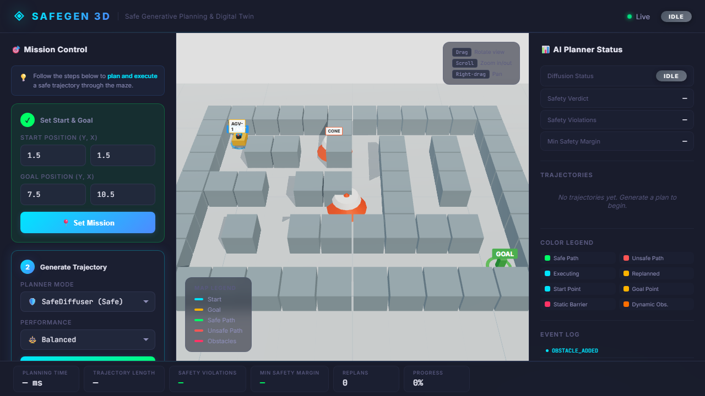

# SAFEGEN 3D: Safe Generative Planning & 3D Interactive Digital Twin

[](https://proceedings.iclr.cc/paper_files/paper/2025/file/f95606d8e870020085990d9650b4f2a1-Paper-Conference.pdf)
[]()
[-purple.svg)]()
[]()

> **SAFEGEN 3D** brings the breakthrough mathematical contributions of **SafeDiffuser (ICLR 2025)** into an interactive, real-time 3D Digital Twin. It showcases how Control Barrier Functions (CBFs) and Finite-Time Diffusion Invariance prevent generative diffusion models from generating collision-prone, unsafe trajectories.

---

## 📸 Interactive Digital Twin in Action

### Use Case: Real-Time Dynamic Obstacle Replanning
The screenshot below demonstrates the live interactive 3D environment where the generative diffusion model continuously computes safe trajectories. When a new dynamic obstacle (hazard) is introduced in real-time, the system leverages the Control Barrier Functions (CBFs) to instantly replan a collision-free path, showcasing the safety-first architecture of SAFEGEN 3D.



---

## 🎯 What Was Reproduced vs. What Was Added

In strict adherence to scientific integrity and research-to-code traceability:

| Component | Source / Classification | Description |
|---|---|---|
| **Temporal UNet Denoising** | `[SPECIFIED]` | Direct reproduction of 1D Conv Temporal UNet score model from *SafeDiffuser* Sec. 3.1. |
| **Control Barrier Functions (CBF)** | `[SPECIFIED]` | Continuous & discrete super-ellipsoid barrier functions ($p=2, 4$) with Lie derivatives. |
| **Time-Varying Relaxation (TVS)** | `[SPECIFIED]` | Sigmoid relaxation $\sigma(k_{\mathrm{bias}} - k)$ transitioning from unconstrained drift to hard boundary invariance. |
| **Analytical Dual KKT Solver** | `[SPECIFIED]` | Exact closed-form dual solver (`invariance_time_cf`) from upstream Appendix C. |
| **Deterministic Kinematic Simulator** | `[ADAPTATION FOR LOCAL HARDWARE]` | Replaced Linux-only MuJoCo 200/D4RL with self-contained 2D maze engine with identical coordinate scales. |
| **Interactive 3D Digital Twin** | `[ENGINEERING ADDITION]` | React + Three.js / React Three Fiber interactive environment replacing static 2D matplotlib dumps. |
| **Dynamic Obstacle & Replanning** | `[ENGINEERING ADDITION]` | Event-driven closed-loop replanning triggered by in-flight dynamic obstacle injection. |
| **FastAPI REST & WebSocket Layer** | `[ENGINEERING ADDITION]` | Production-grade async backend serving real-time world state streaming. |

---

## 🚀 Quickstart Guide

### Prerequisites
- Python 3.10+ (tested on Windows 11 with Python 3.12)
- Node.js 18+ & npm
- NVIDIA GPU (RTX 4050 Laptop GPU / 6GB VRAM supported) or CPU

### 1. Launch Dev Services
Run the unified PowerShell launcher:
```powershell
.\scripts\start_dev.ps1
```
- **Web UI:** [http://localhost:5173](http://localhost:5173)
- **API Swagger Docs:** [http://127.0.0.1:8000/docs](http://127.0.0.1:8000/docs)

### 2. Run Autonomous Verification Agent
```powershell
.\scripts\run_verification.ps1
```
Evaluates all requirements against test suites and updates `verification/report.md`.

---

## 🔬 Core Research Contribution Visualized

```
             Point A (Start) ──────────────────────────► Point B (Goal)
                                    ▲
                                    │
                           [ RESTRICTED ZONE ]

  🔴 Vanilla Diffuser: Cuts straight through restricted zone (Violations > 0)
  🟢 SafeDiffuser (TVS): Repels trajectory boundary outside barrier (Violations = 0)
  🟠 Dynamic Replan: Re-routes in real-time when new hazard appears on path
```

---

## 📂 Repository Architecture

```
project/
├── upstream/SafeDiffuser/     # Untouched upstream reference clone
├── app/
│   ├── ml/                   # Core ML & SafeDiffuser implementation
│   │   ├── diffusion/        # Temporal UNet & Gaussian diffusion engine
│   │   ├── safety/           # CBF barrier functions, Lie derivatives, TVS solvers
│   │   └── planner/          # Unified PlannerService (Vanilla vs SafeDiffuser)
│   ├── simulation/           # Digital Twin world state & Maze2D simulator
│   ├── backend/              # FastAPI REST API & WebSocket server
│   └── frontend/             # Vite + React + Three.js 3D Digital Twin
├── configs/                  # Hardware profiles (configs/local_4050.yaml)
├── research/                 # Evidence-driven scientific specifications (7 files)
├── docs/                     # Product, architecture, and verification documentation (15 files)
├── tests/                    # ML, API, and Integration test suites
├── scripts/                  # Unified launcher and test automation scripts
└── verification/             # Autonomous requirement verification outputs
```

---

## 📊 Verification Status

- **Requirements Matrix:** [docs/REQUIREMENTS_MATRIX.md](docs/REQUIREMENTS_MATRIX.md)
- **Latest Verification Report:** [verification/report.md](verification/report.md)
- **Paper-to-Code Traceability:** [research/PAPER_TO_CODE_MAP.md](research/PAPER_TO_CODE_MAP.md)
