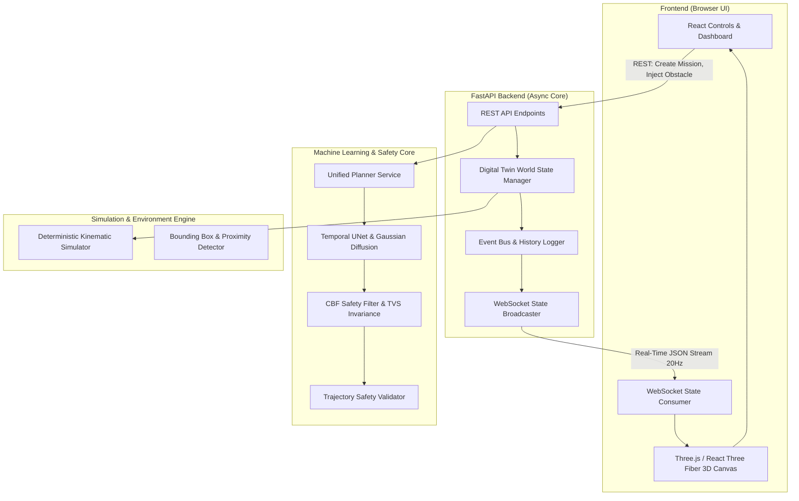
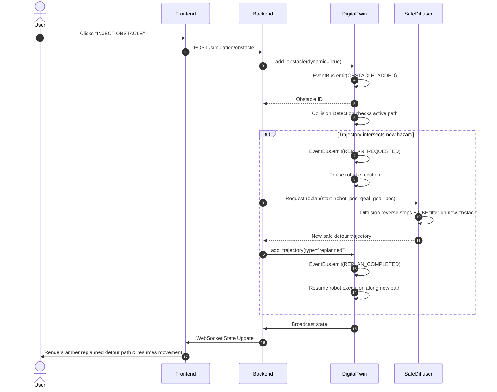

# SAFEGEN 3D — System Architecture & Technical Design

**Classification:** Comprehensive Full-Stack Architecture  
**Standards:** High-Performance Generative AI & Event-Driven Digital Twin  

---

## 1. High-Level System Architecture

---

## 2. Component Decompositions

### 2.1 Frontend Architecture (React + Three.js)
- **Framework:** Vite + React 18 with modern component hooks (`useState`, `useEffect`, `useCallback`, `useRef`).
- **3D Engine:** `@react-three/fiber` (declarative Three.js wrapper) and `@react-three/drei` (camera controls, procedural lighting, grids).
- **Styling System:** Vanilla CSS (`src/App.css`) with CSS custom properties, deep glassmorphic dark palette (`#0a0d18`, `#111827`, `#1f2937`), glowing trajectory shaders, and responsive flex grid.
- **Panels:**
  - **Header:** System title, connection status pill, active simulation phase badge.
  - **Left Mission Panel:** Coordinate inputs, obstacle configuration, planner mode toggle (Vanilla vs SafeDiffuser), performance mode selector.
  - **Center Viewport:** 3D digital twin rendering maze walls, floor grid, robot avatar, start/goal beacons, restricted zones, and multiple color-coded trajectory paths.
  - **Right AI & Safety Panel:** Real-time metrics, active barrier function state, QP convergence stats, event logs.
  - **Bottom Status Bar:** Latency counter, safety margin meter, replanning counter.

### 2.2 Backend Architecture (FastAPI)
- **Lifespan Manager:** Initializes maze topology, loads configurations, and lazily mounts ML models.
- **REST Endpoints:**
  - `POST /planning/create`: Sets mission start and goal coordinates.
  - `POST /planning/generate`: Dispatches diffusion sampling in Vanilla or SafeDiffuser mode.
  - `POST /planning/validate`: Assesses current trajectory safety margins.
  - `POST /planning/replan`: Triggers immediate re-route from current robot position.
  - `POST /simulation/obstacle`: Injects dynamic or static hazards.
  - `POST /simulation/start`, `/pause`, `/reset`: Controls playback clock.
  - `GET /metrics`: Aggregates safety margins, planning times, collision statistics.
- **WebSocket Protocol:** Streams world state updates (robot coordinates, obstacle positions, trajectory polylines, event logs) at 20 Hz to all connected browser clients.

### 2.3 Machine Learning & Safety Architecture
- **Temporal UNet:** 1D dilated convolutions with residual blocks, group normalization, and sinusoidal timestep embeddings.
- **Gaussian Diffusion Process:** Discrete cosine/linear variance schedule, forward noising `q_sample`, reverse denoising `p_sample` with start/goal boundary conditioning.
- **Safety Engine:**
  - `SuperEllipsoidBarrier`: Parameterized $b(\mathbf{x}) = ((y - y_c)/r_y)^p + ((x - x_c)/r_x)^p - 1 - \delta$ with exact analytic Lie derivatives $\nabla_{\mathbf{x}} b$.
  - `TVS Relaxation`: Time-varying barrier $B(\mathbf{x}, k) = b(\mathbf{x}) - \sigma(k_{\mathrm{bias}} - k)$ enabling smooth transition from exploratory noise to hard collision avoidance.
  - `Dual Solvers`: High-speed analytical KKT dual solver for real-time web responsiveness with seamless fallback to general convex quadratic programming (`cvxpy`).

---

## 3. Dynamic Replanning Event Flow

